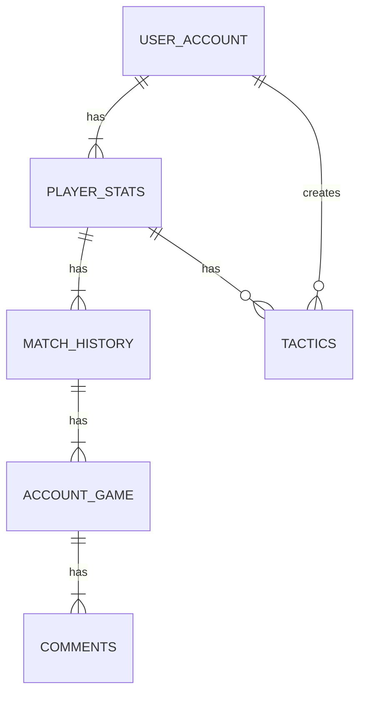
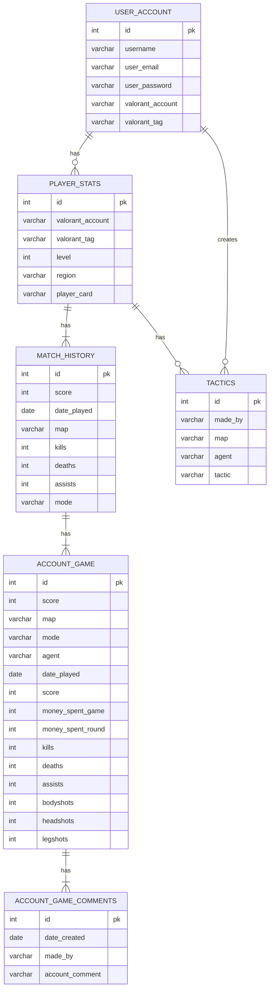

# Overview

Create an application that tracks Valorant profiles, stats, match history, match data using this api  https://docs.henrikdev.xyz/valorant.html
and also create an api to make user profiles, create different tips for each map aswell as adding their own strategies for any maps/agent

## Must have
- Must have a login
- Must have indivitual profiles
- User must be able to view his Valorant stats on his profile
- User must be able to view other players profiles and stats
- User must be able to see tips for any map/agent aswell as adding new tips or strategies 

## Should have
- A user should be able to see his match history
- A user should be able to see other players match history
- The users should be able to search different player profiles

## Could have 
- The users could be able to add comments to other player profiles
- There could be a badge system on the profiles based on their stats
- The tips could be youtube videos

## Will not have
- The app wont track any other games

# Diagram

# Entity relation diagram

# API Specification

## Stats
### All the valorant stats come from this [api](https://docs.henrikdev.xyz/valorant.html).

+ GET /valorant/v1/account/:name/:tag - Gets all account data
  
+ GET /valorant/v3/matches/:region/:name/:tag - Gets match history

## Users

+ GET /users - Returns all users

+ GET /users/{valorant_account} - Returns the user associated to the Valorant account

+ POST /users - Creates an user

+ UPDATE /users/{id} - Updates the data for the selected user

+ DELETE /users/{id} - Deletes the selected user

## Comments

+ GET /comments - Get all comments

+ GET /user/{id_match}/comments - Get the comments inside the match

+ POST /user/{id_match}/comments - Post a comment inside the match

+ UPDATE /user/{id_match}/comments - Update a comment inside the match

+ DELETE /user/{id_match}/comments - Update a comment inside the match

## Tactics

+ GET /tactics - Get all tactics

+ GET /tactics/{map} - Get all tactics for a specific map

+ GET /tactics/{agent} - Get all tactics for an agent

+ GET /tactics/{valorant_account} - Get all tactics created by that user

+ POST /tactics/{map} - Post a new tactic for the specified map

+ POST /tactics/{agent} - Post a new tactic for the specified agent

+ UPDATE /tactics/{map}/{id} - Update tactic

+ UPDATE /tactics/{agent}/{id} - Update tactic

+ DELETE /tactics/{map}/{id} - Delete tactic

+ DELETE /tactics/{agent}/{id} -Delete tactic

