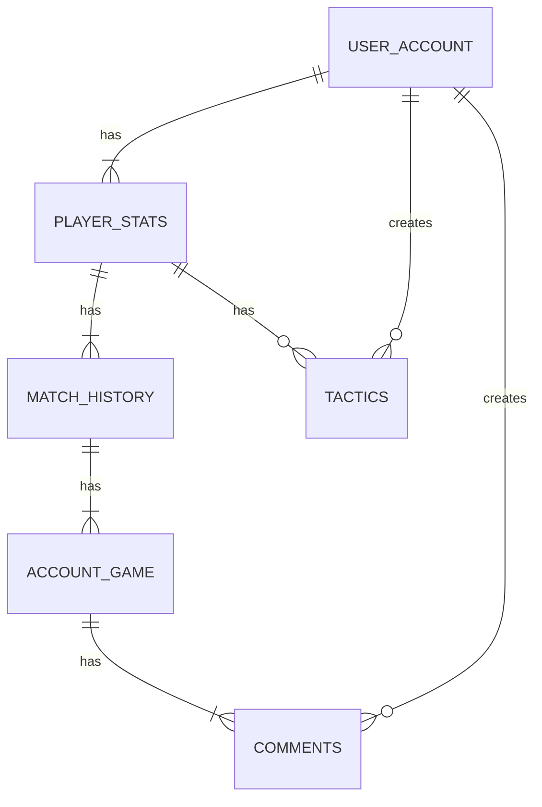
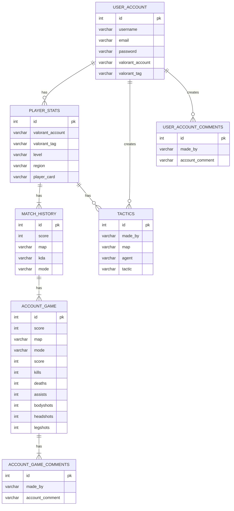

# Overview

Create an application that tracks Valorant profiles, stats, match history, match data using this api  https://docs.henrikdev.xyz/valorant.html
and also create an api to make user profiles, create different tips for each map aswell as adding their own strategies for any maps/agent

## Must have
- Must have a login
- Must have indivitual profiles
- User must be able to view his Valorant stats on his profile
- User must be able to view other players profiles and stats
- User must be able to see tips for any maps/agent aswell as adding new tips or strategies 

## Should have
- A user should be able to see his match history
- A user should be able to see other players match history
- The users should be able to search different player profiles

## Could have 
- The users could be able to add comments to other player profiles
- There could be a badge system on the profiles based on their stats
- The tips could be youtube videos

## Will not have
- The app wont track any other games

# Diagram

# Entity relation diagram
